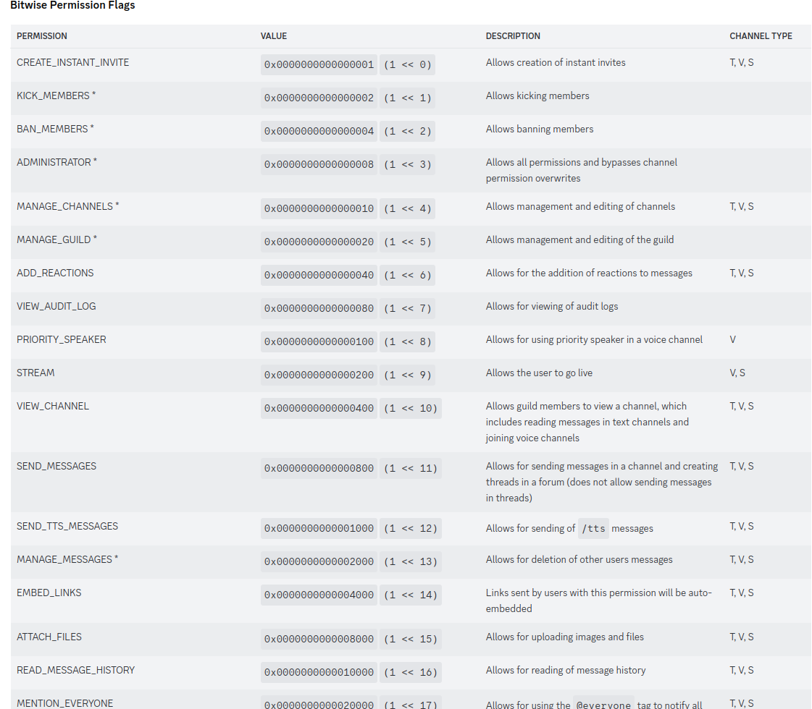
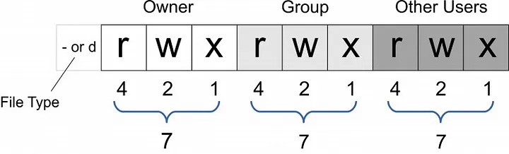

= Dynamic roles & permissions

* User has many roles
* Role has many permissions
* Permission has many operations

== Operations

[source]
----
c r u d
8 4 2 1 = 15 = 0xF
----

d > c > u > r

[source]
----
d c u r
8 4 2 1 = 15 = 0xF
----

== Implementation example

User permission consists of a string permission value:

`00010020400FF080....F82`

Each permission is an Enum: name, index

ProductPermission (name="product", 56)

to check a user's product read permission:

`levels.charAt(56) & 4`

=== Use `long` for bitwise operations.

https://stackoverflow.com/questions/30631679/bitwise-not-for-double-in-java

=== Examples

* https://discord.com/developers/docs/topics/permissions#permissions-bitwise-permission-flags[Discord Bitwise Permission Flags]

it has total of 50 permissions.

'''

